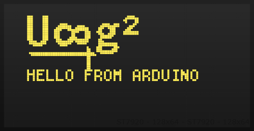
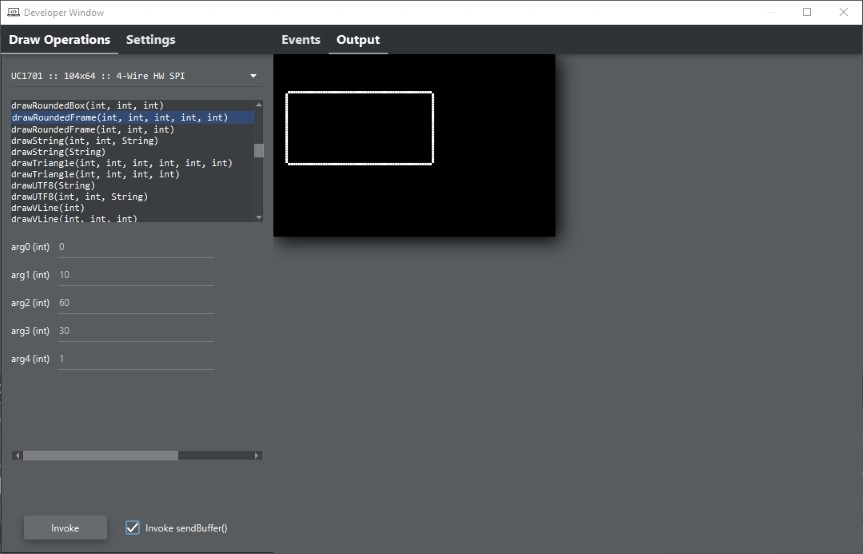
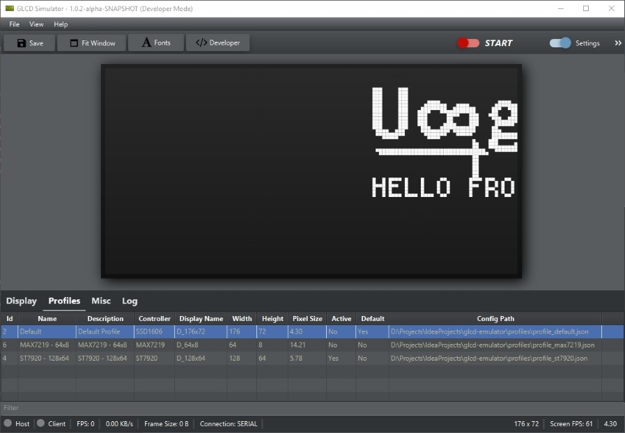

# Graphics LCD Simulator

Graphics LCD prototyping tool for hobbyists

#### MAX7219 Simulation

#### ST7920 Simulation

## Demo

## Overview

The client can be configured to use either Serial or TCP/IP for data transmission.

### Arduino

The Arduino client extends from the [U8g2 class](https://github.com/olikraus/u8g2/blob/master/cppsrc/U8g2lib.h). It can then be used just like how it is used in any actual u8g2 development. Data is transmitted from the client to the simulator program (via Serial or TCP/IP)

## Requirements

- 64 bit Java 8 or higher

## Client libraries

- [Arduino client](https://github.com/ribasco/glcd-emulator-client-arduino) (Also available in [Platform IO](https://platformio.org/lib/show/5882/U8g2%20GLCD%20Remote%20Client))
- [Java client (Using ucgdisplay)](https://github.com/ribasco/glcd-emulator-client-java)
- C/C++ (Coming soon)

## Project Resources

- [Release](https://github.com/ribasco/glcd-emulator/releases)
- [Snapshots](https://ci.appveyor.com/project/ribasco34191/glcd-emulator/build/artifacts)

## Limitations

- Does not yet support 32 bit java ([ucgdisplay](https://github.com/ribasco/ucgdisplay) only supports 64bit at the moment)

## Installation

### Manual

Extract the archive `glcd-emulator-<version>-amd64.zip` or `glcd-emulator-<version>-amd64.tar.gz` to any directory and use the run script to start the application

### Installer

Execute any of the files below whatever matches your target operating system.

- Windows: `glcd-emulator-setup-amd64.exe`
- Linux (Debian): `glcd-emulator-<version>-amd64.deb`
- Mac OSX: `glcd-emulator-<version>-amd64.pkg`

## Features

### Cross-platform

Supports Windows, Mac OSX and Linux

### Client available for Arduino/C/C++ and Java clients

See [Client Libraries](#Client-libraries)

### Customizable look and feel

### Font Browser

Browse through all available u8g2 fonts

### Supports over 40+ displays

Most displays are available and supported by the simulator, but some limitations may apply depending on the hardware used.

### Screenshots

Take screenshots (Use F5 key) and save it as PNG image format

### Developer mode

Developer mode allows you to play around with the functions available in the u8g2 graphics library. You will be able to preview the output and inspect the generated instructions for the operation. Please note that this is not enabled by default, you can enable this by specifying the `-dev` application startup parameter.

### Profile Support

You can create profiles to store individual settings

